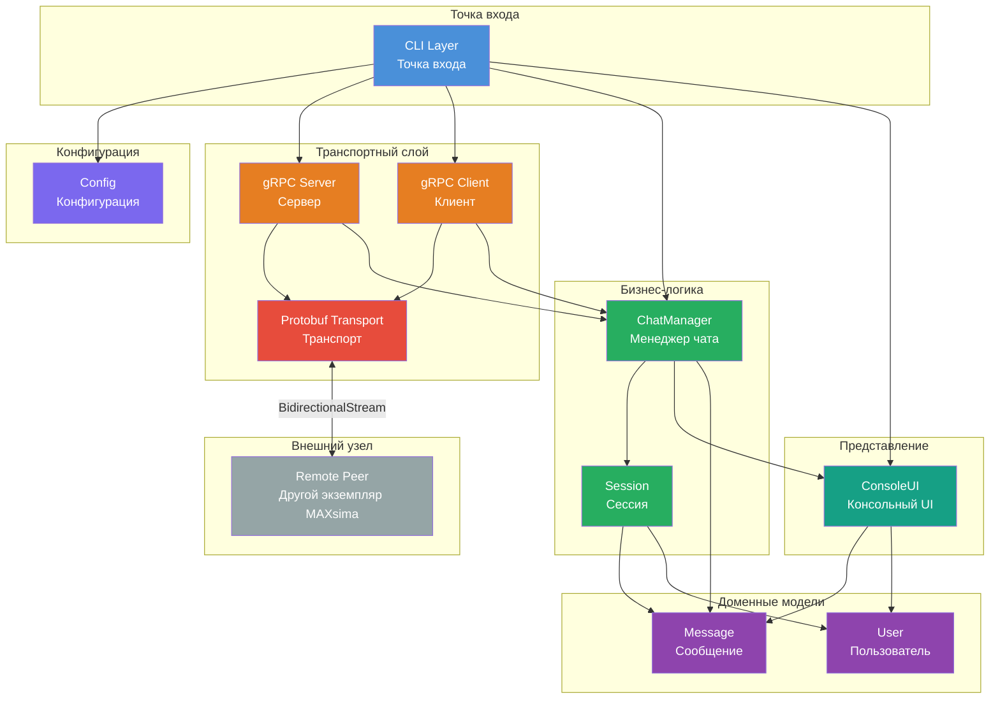
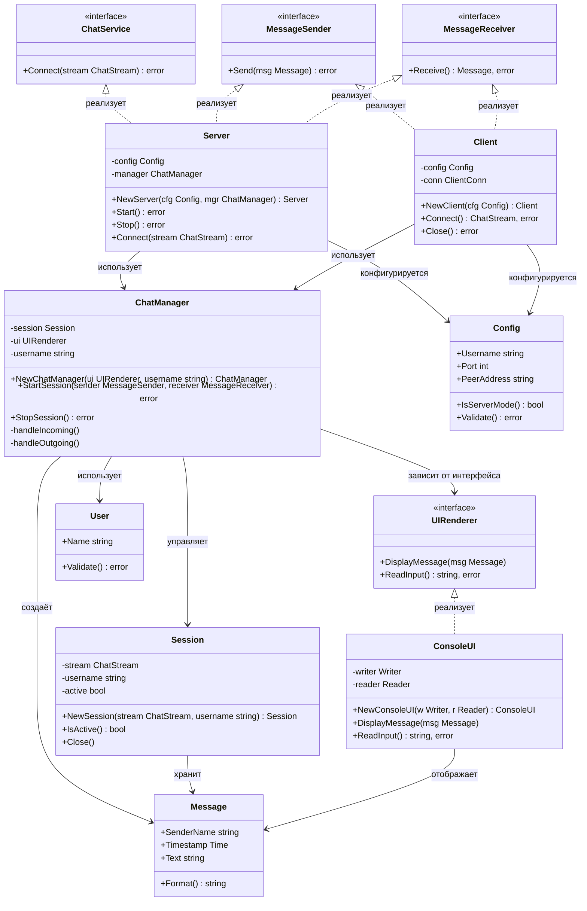
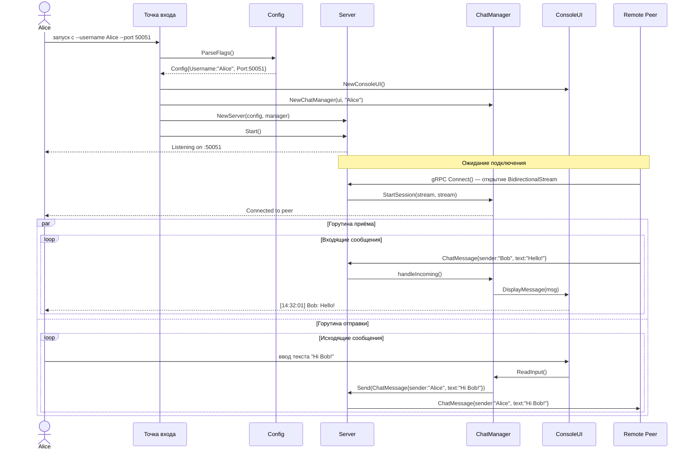
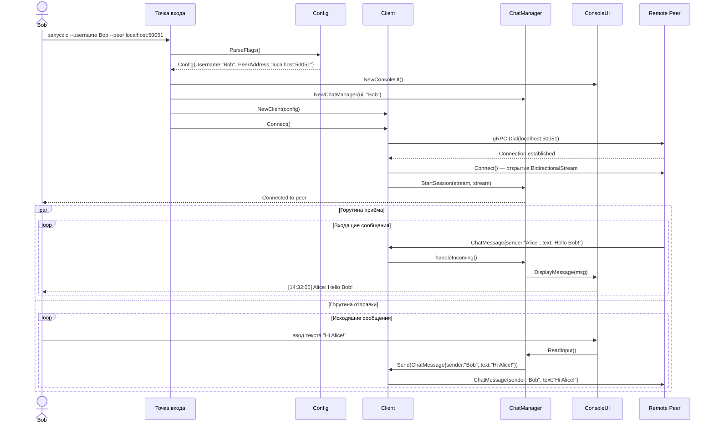
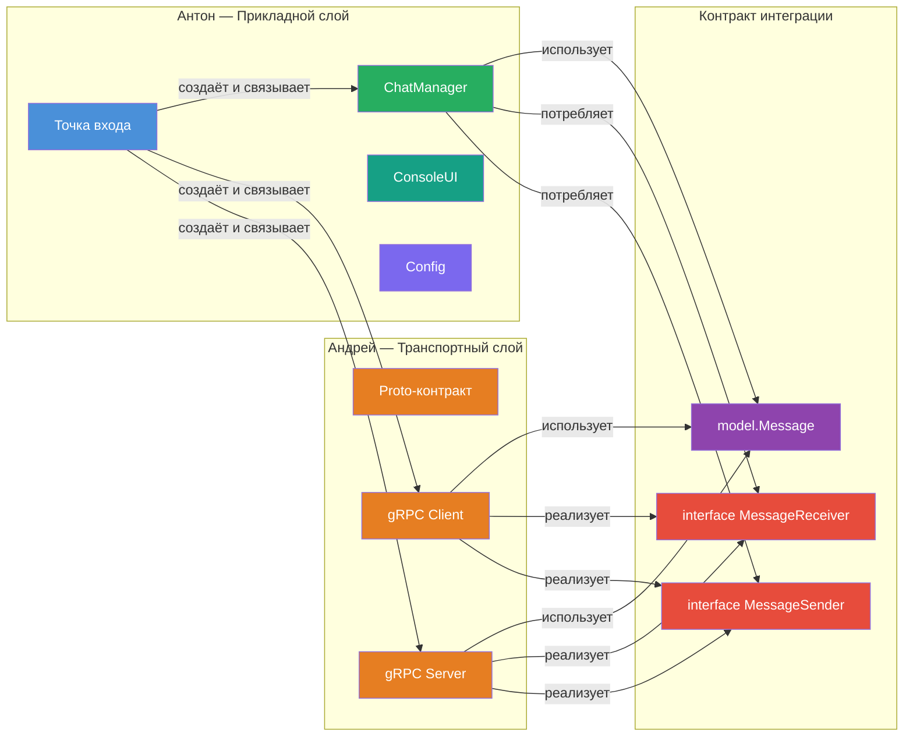

# Архитектурная документация: MAXsima

> **Тип проекта:** Консольный peer-to-peer чат  
> **Язык реализации:** Go  

---

## Содержание

1. [Введение и цели проекта](#1-введение-и-цели-проекта)
2. [Функциональные и нефункциональные требования](#2-функциональные-и-нефункциональные-требования)
3. [Архитектурные решения и обоснование выбора технологий](#3-архитектурные-решения-и-обоснование-выбора-технологий)
4. [Структура проекта](#4-структура-проекта)
5. [Диаграмма компонентов](#5-диаграмма-компонентов)
6. [Диаграмма классов](#6-диаграмма-классов)
7. [Описание gRPC-контракта](#7-описание-grpc-контракта)
8. [Описание режимов работы приложения](#8-описание-режимов-работы-приложения)
9. [Декомпозиция задач между участниками команды](#9-декомпозиция-задач-между-участниками-команды)

---

## 1. Введение и цели проекта

### 1.1 Назначение системы

**MAXsima** — консольное приложение для двустороннего обмена текстовыми сообщениями в реальном времени между двумя узлами (peer-ами) без центрального сервера-посредника. Каждый экземпляр приложения может выступать одновременно как сервер (принимает входящие соединения) и как клиент (инициирует соединение с удалённым peer-ом).

Коммуникация осуществляется через gRPC с использованием двунаправленного стриминга, что обеспечивает низкую задержку и симметричный обмен сообщениями без polling-а.

Приложение запускается в терминале. Один участник запускает экземпляр в режиме **сервера** — ожидает входящего подключения на заданном порту. Второй участник запускает экземпляр в режиме **клиента** — подключается к серверу по указанному адресу и порту. После установки соединения оба участника могут отправлять и получать сообщения в режиме реального времени. Каждое сообщение отображается с именем отправителя, датой и временем.

---

## 2. Функциональные и нефункциональные требования

### 2.1 Функциональные требования

| ID | Требование | Приоритет |
|----|-----------|-----------|
| **FR-01** | Приложение поддерживает **режим сервера**: запуск без указания адреса peer-а, прослушивание входящих соединений на заданном порту | Высокий |
| **FR-02** | Приложение поддерживает **режим клиента**: запуск с указанием адреса и порта peer-а для установки исходящего соединения | Высокий |
| **FR-03** | При запуске пользователь задаёт **имя** через аргумент командной строки `--username` | Высокий |
| **FR-04** | Каждое входящее сообщение отображается в консоли в формате: `[дата время] Имя: текст сообщения` | Высокий |
| **FR-05** | Пользователь может **вводить и отправлять сообщения** в реальном времени, не прерывая приём входящих сообщений | Высокий |
| **FR-06** | Обмен сообщениями осуществляется **двусторонне**: оба участника могут отправлять и получать сообщения одновременно | Высокий |
| **FR-07** | Приложение корректно завершает работу при закрытии соединения или получении сигнала прерывания | Средний |
| **FR-08** | Конфигурация (порт, адрес peer-а, имя пользователя) задаётся через **аргументы командной строки** | Высокий |

### 2.2 Нефункциональные требования

#### Производительность

| ID | Требование |
|----|-----------|
| **NFR-P01** | Задержка доставки сообщения не должна превышать сетевую задержку более чем на 10 мс при локальном соединении |
| **NFR-P02** | Приложение не должно потреблять более 50 МБ оперативной памяти в режиме ожидания |
| **NFR-P03** | Горутины для чтения и записи должны работать независимо, не блокируя друг друга |

#### Расширяемость

| ID | Требование |
|----|-----------|
| **NFR-E01** | Архитектура должна допускать замену консольного UI на графический без изменения бизнес-логики |
| **NFR-E02** | Транспортный слой должен быть изолирован за интерфейсом, допуская замену gRPC на иной протокол |
| **NFR-E03** | Добавление новых полей в сообщение не должно требовать изменений в слоях выше транспортного |

#### Читаемость и качество кода

| ID | Требование |
|----|-----------|
| **NFR-Q01** | Каждый пакет должен иметь единственную зону ответственности |
| **NFR-Q02** | Все публичные типы и функции должны быть задокументированы Go-комментариями |
| **NFR-Q03** | Код должен проходить проверку линтером без предупреждений |
| **NFR-Q04** | Покрытие тестами бизнес-логики — не менее 70% |

---

## 3. Архитектурные решения и обоснование выбора технологий

### 3.1 Выбор gRPC

| Критерий | gRPC | Альтернатива (WebSocket / сырой TCP) |
|----------|------|--------------------------------------|
| **Двунаправленный стриминг** | Нативная поддержка через `BidirectionalStreaming` | Требует ручной реализации |
| **Типизация** | Строгая типизация через Protocol Buffers | Нет встроенной схемы |
| **Производительность** | HTTP/2 мультиплексирование, бинарная сериализация | HTTP/1.1 или сырой TCP |
| **Контракт** | Proto-файл как единый источник истины | Документация в произвольном формате |
| **Кодогенерация** | Автоматическая генерация клиента и сервера | Ручная реализация |

**Ключевое преимущество:** метод `BidirectionalStreaming` позволяет обоим участникам отправлять и получать сообщения по одному соединению без polling-а, что точно соответствует требованию FR-06.

### 3.2 Выбор Go

| Характеристика | Обоснование |
|----------------|-------------|
| **Горутины и каналы** | Нативная поддержка конкурентности позволяет запустить независимые горутины для чтения ввода и приёма сообщений без блокировки (NFR-P03) |
| **Стандартная библиотека** | Встроенные пакеты для работы с сетью, вводом-выводом и флагами командной строки покрывают большинство потребностей без внешних зависимостей |
| **Сетевое программирование** | Встроенная поддержка TCP/TLS, минимальный boilerplate |
| **Статическая типизация** | Снижает класс ошибок на этапе компиляции |
| **Единый бинарный файл** | Простота развёртывания без зависимостей от runtime |

### 3.3 Peer-to-Peer без центрального сервера

| Аргумент | Описание |
|----------|----------|
| **Симметричность** | Оба участника равноправны; один временно выступает сервером только для установки соединения |
| **Отсутствие единой точки отказа** | Нет центрального сервера, который мог бы стать узким местом |
| **Простота развёртывания** | Достаточно одного бинарного файла на каждой машине |
| **Соответствие YAGNI** | Центральный сервер не нужен для двух участников |

После установки gRPC-соединения оба узла используют двунаправленный стрим — соединение становится функционально симметричным.

---

## 4. Структура проекта

Проект организован по стандартам Go-проектов с разделением на слои. Точка входа отвечает за запуск и инициализацию. Внутренняя логика разбита на изолированные компоненты. Транспортный контракт хранится отдельно и генерируется автоматически.

| Слой | Компонент | Ответственность |
|------|-----------|----------------|
| **Точка входа** | CLI Layer | Разбор CLI-флагов, инициализация компонентов, выбор режима запуска |
| **Транспортный** | gRPC Server | Реализация gRPC-сервера, приём входящих соединений |
| **Транспортный** | gRPC Client | Установка исходящего gRPC-соединения с peer-ом |
| **Бизнес-логика** | ChatManager | Управление сессией, маршрутизация сообщений, оркестрация горутин |
| **Представление** | ConsoleUI | Форматированный вывод сообщений, асинхронное чтение ввода пользователя |
| **Доменные модели** | Message, User | Структуры доменных объектов, независимые от транспортного слоя |
| **Контракт** | Proto-контракт | Определение gRPC-сервиса и Protobuf-сообщений; сгенерированный код |
| **Конфигурация** | Config | Структура конфигурации, парсинг и валидация параметров запуска |

---

## 5. Диаграмма компонентов

### 5.1 Описание потоков данных

| Поток | Направление | Описание |
|-------|-------------|----------|
| **CLI → Config** | Инициализация | Разбор флагов, создание объекта конфигурации |
| **CLI → Server / Client** | Инициализация | Создание транспортного компонента в зависимости от режима |
| **CLI → ChatManager** | Инициализация | Передача зависимостей (транспорт, UI) |
| **Server / Client → Protobuf** | Транспорт | Сериализация и десериализация сообщений |
| **Protobuf ↔ Remote Peer** | Сеть | Двунаправленный gRPC-стрим |
| **Server / Client → ChatManager** | Данные | Передача принятых сообщений |
| **ChatManager → UI** | Отображение | Передача сообщений для вывода в консоль |
| **ChatManager → Session** | Состояние | Управление состоянием соединения |

---

## 6. Диаграмма классов

### 6.1 Описание интерфейсов

| Интерфейс | Назначение | Реализации |
|-----------|-----------|------------|
| `ChatService` | Контракт gRPC-сервиса | `Server` |
| `MessageSender` | Отправка сообщений через транспорт | `Server`, `Client` |
| `MessageReceiver` | Приём сообщений из транспорта | `Server`, `Client` |
| `UIRenderer` | Отображение сообщений и чтение ввода | `ConsoleUI` |

**Принцип инверсии зависимостей (DIP):** `ChatManager` зависит от интерфейсов `MessageSender`, `MessageReceiver` и `UIRenderer`, а не от конкретных реализаций. Это позволяет подменять транспорт и UI без изменения бизнес-логики.

---

## 7. Описание gRPC-контракта

### 7.1 Сервис `ChatService`

Сервис определяет единственный метод `Connect` с типом взаимодействия **BidirectionalStreaming**. Оба участника могут отправлять сообщения в любой момент без ожидания ответа от другой стороны. Соединение остаётся открытым на протяжении всей сессии чата.

### 7.2 Сообщение `ChatMessage`

| Поле | Тип | Номер | Описание |
|------|-----|-------|----------|
| `sender_name` | `string` | 1 | Имя отправителя, заданное при запуске через `--username` |
| `timestamp` | `int64` | 2 | Unix timestamp в секундах (UTC) — момент отправки сообщения |
| `text` | `string` | 3 | Текстовое содержимое сообщения |

### 7.3 Метод `Connect`

| Параметр | Тип | Описание |
|----------|-----|----------|
| Входной стрим | `stream ChatMessage` | Сообщения от клиента к серверу |
| Выходной стрим | `stream ChatMessage` | Сообщения от сервера к клиенту |

Тип метода — `BidirectionalStreaming`. После открытия стрима оба участника могут независимо отправлять и получать сообщения. Закрытие стрима с любой стороны завершает сессию.

### 7.4 Структура контракта

Контрактный файл содержит:

- Объявление синтаксиса `proto3`
- Объявление пакета `chat`
- Опцию генерации Go-кода
- Определение сервиса `ChatService` с методом `Connect`
- Определение сообщения `ChatMessage` с полями `sender_name`, `timestamp`, `text`

Сгенерированный транспортный код размещается в отдельном подпакете и не редактируется вручную.

---

## 8. Описание режимов работы приложения

### 8.1 Режим сервера

**Параметры запуска:**

| Флаг | Обязательный | Описание |
|------|-------------|----------|
| `--username` | Да | Имя пользователя для отображения в сообщениях |
| `--port` | Да | Порт для прослушивания входящих соединений |
| `--peer` | Нет | Отсутствие флага определяет режим сервера |

**Последовательность инициализации (режим сервера):**

---

### 8.2 Режим клиента

**Параметры запуска:**

| Флаг | Обязательный | Описание |
|------|-------------|----------|
| `--username` | Да | Имя пользователя для отображения в сообщениях |
| `--peer` | Да | Адрес и порт peer-а для подключения |
| `--port` | Нет | Наличие `--peer` без `--port` определяет режим клиента |

**Последовательность инициализации (режим клиента):**

### 8.3 Определение режима запуска

Режим определяется автоматически по наличию флага `--peer`:

| Условие | Режим |
|---------|-------|
| Флаг `--peer` **не указан**, флаг `--port` указан | Режим сервера — ожидание входящего соединения |
| Флаг `--peer` **указан** | Режим клиента — исходящее подключение к peer-у |
| Оба флага отсутствуют | Ошибка валидации конфигурации, завершение с сообщением |

---

## 9. Декомпозиция задач между участниками команды

### 9.1 Участник: Андрей — Транспортный слой

**Зона ответственности:** всё, что связано с gRPC-коммуникацией и сетевым транспортом.

| Задача | Описание |
|--------|----------|
| **Proto-контракт** | Определение сервиса `ChatService`, сообщения `ChatMessage`, настройка генерации кода |
| **gRPC-сервер** | Реализация `ChatServiceServer`, обработка входящих соединений, передача сообщений в `ChatManager` |
| **gRPC-клиент** | Установка соединения с peer-ом, открытие двунаправленного стрима |
| **Тесты транспорта** | Юнит-тесты транспортного слоя с mock-стримами |
| **Сборка proto** | Настройка генерации Go-кода из контрактного файла |

**Интерфейсы, которые Андрей реализует:**

| Интерфейс | Реализующий тип | Описание |
|-----------|----------------|----------|
| `MessageSender` | `Server`, `Client` | Метод `Send(msg Message) error` — отправка сообщения через gRPC-стрим |
| `MessageReceiver` | `Server`, `Client` | Метод `Receive() (Message, error)` — чтение сообщения из gRPC-стрима |

**Интерфейсы, которые Андрей потребляет:**

| Интерфейс | Предоставляет | Описание |
|-----------|--------------|----------|
| `ChatManager.StartSession` | Антон | Метод для передачи транспортных зависимостей в менеджер чата |

---

### 9.2 Участник: Антон — Прикладной слой

**Зона ответственности:** CLI, UI, доменные модели, бизнес-логика и интеграция всех компонентов.

| Задача | Описание |
|--------|----------|
| **CLI-парсинг** | Разбор флагов `--username`, `--port`, `--peer`; валидация; выбор режима запуска |
| **Доменные модели** | Структуры `Message`, `User`; методы форматирования и валидации |
| **Консольный UI** | Реализация `UIRenderer`: форматированный вывод сообщений, асинхронное чтение ввода |
| **ChatManager** | Оркестрация сессии, управление горутинами, маршрутизация сообщений |
| **Тесты** | Юнит-тесты прикладного слоя с mock-зависимостями |
| **Интеграция** | Сборка всех компонентов, связывание зависимостей (Composition Root) |

**Интерфейсы, которые Антон определяет и реализует:**

| Интерфейс | Реализующий тип | Описание |
|-----------|----------------|----------|
| `UIRenderer` | `ConsoleUI` | Методы `DisplayMessage` и `ReadInput` — изолированный слой представления |

**Интерфейсы, которые Антон потребляет:**

| Интерфейс | Предоставляет | Описание |
|-----------|--------------|----------|
| `MessageSender` | Андрей | Используется в `ChatManager` для отправки сообщений |
| `MessageReceiver` | Андрей | Используется в `ChatManager` для приёма сообщений |

---

### 9.3 Диаграмма точек интеграции

