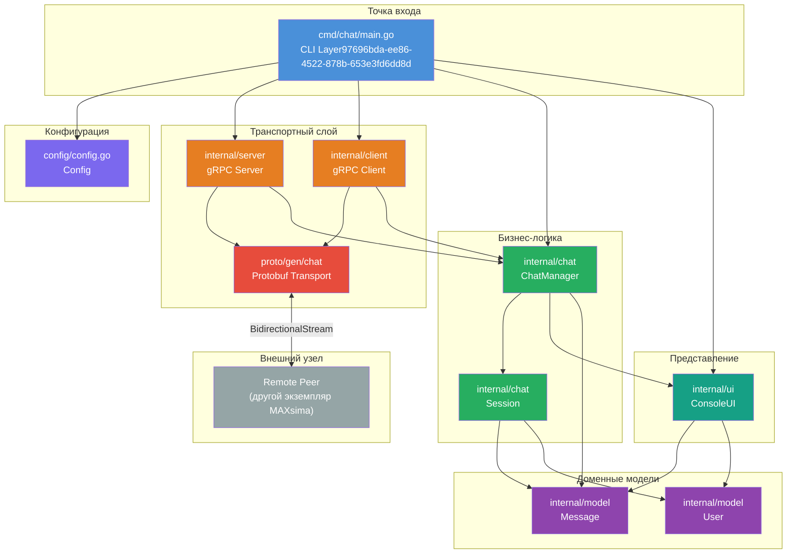
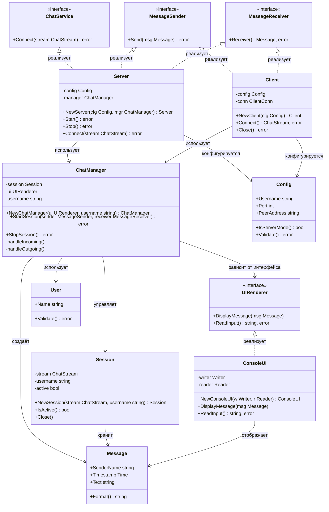
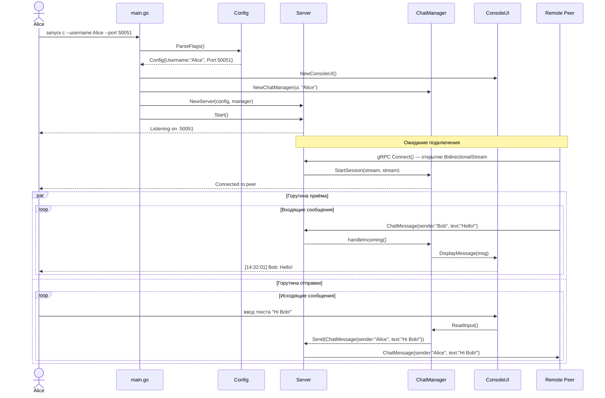
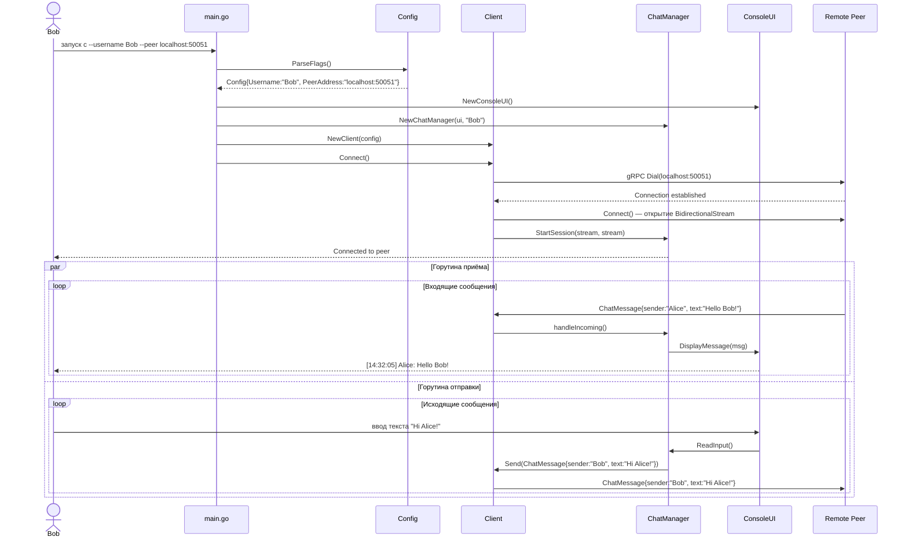
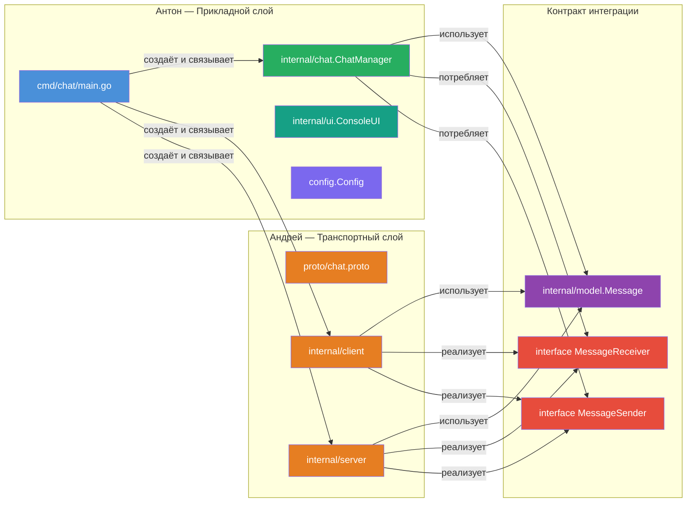
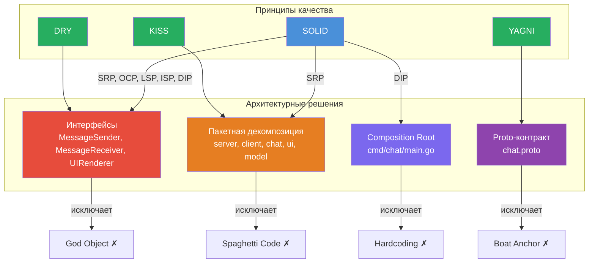

## 4. Структура проекта

```
MAXsima/
├── cmd/
│   └── chat/
│       └── main.go                 # Точка входа: разбор CLI-флагов, инициализация, запуск
├── internal/
│   ├── server/
│   │   ├── server.go               # gRPC-сервер: реализация ChatServiceServer
│   │   └── server_test.go          # Юнит-тесты сервера
│   ├── client/
│   │   ├── client.go               # gRPC-клиент: установка соединения с peer-ом
│   │   └── client_test.go          # Юнит-тесты клиента
│   ├── chat/
│   │   ├── manager.go              # ChatManager: управление сессией, маршрутизация сообщений
│   │   ├── manager_test.go         # Юнит-тесты менеджера чата
│   │   └── session.go              # Session: состояние активного соединения
│   ├── ui/
│   │   ├── console.go              # ConsoleUI: вывод сообщений, чтение ввода пользователя
│   │   └── console_test.go         # Юнит-тесты UI с mock-зависимостями
│   └── model/
│       ├── message.go              # Доменная модель Message
│       └── user.go                 # Доменная модель User
├── proto/
│   ├── chat.proto                  # Определение gRPC-сервиса и Protobuf-сообщений
│   └── gen/
│       └── chat/
│           ├── chat.pb.go          # Сгенерированный Protobuf-код (не редактировать вручную)
│           └── chat_grpc.pb.go     # Сгенерированный gRPC-код (не редактировать вручную)
├── config/
│   └── config.go                   # Структура Config, парсинг и валидация конфигурации
├── go.mod                          # Go Modules: объявление модуля и зависимостей
├── go.sum                          # Контрольные суммы зависимостей
├── Makefile                        # Цели сборки: build, test, proto, lint
└── README.md                       # Краткое описание и инструкция по запуску
```

### 4.1 Назначение компонентов

| Компонент | Пакет | Ответственность |
|-----------|-------|----------------|
| `main.go` | `cmd/chat` | Точка входа: разбор флагов, создание `Config`, выбор режима, запуск |
| `server.go` | `internal/server` | Реализация `ChatServiceServer`, приём входящих gRPC-соединений |
| `client.go` | `internal/client` | Установка gRPC-соединения с peer-ом, открытие двунаправленного стрима |
| `manager.go` | `internal/chat` | Оркестрация сессии: связывает транспортный слой с UI, управляет горутинами |
| `session.go` | `internal/chat` | Инкапсулирует состояние активного соединения |
| `console.go` | `internal/ui` | Форматирование и вывод сообщений, асинхронное чтение ввода пользователя |
| `message.go` | `internal/model` | Доменная модель `Message` (независима от Protobuf) |
| `user.go` | `internal/model` | Доменная модель `User` |
| `config.go` | `config` | Структура `Config`, валидация параметров запуска |
| `chat.proto` | `proto` | Единый источник истины для gRPC-контракта |

---

# Архитектурная документация: MAXsima

> **Тип проекта:** Консольный peer-to-peer чат  
> **Язык реализации:** Go  
> **Транспортный протокол:** gRPC (двунаправленный стриминг)  
> **Версия документа:** 1.0.0

---

## Содержание

1. [Введение и цели проекта](#1-введение-и-цели-проекта)
2. [Функциональные и нефункциональные требования](#2-функциональные-и-нефункциональные-требования)
3. [Архитектурные решения и обоснование выбора технологий](#3-архитектурные-решения-и-обоснование-выбора-технологий)
4. [Структура проекта](#4-структура-проекта)
5. [Диаграмма компонентов](#5-диаграмма-компонентов)
6. [Диаграмма классов](#6-диаграмма-классов)
7. [Описание gRPC-контракта](#7-описание-grpc-контракта)
8. [Описание режимов работы приложения](#8-описание-режимов-работы-приложения)
9. [Декомпозиция задач между участниками команды](#9-декомпозиция-задач-между-участниками-команды)
10. [Принципы качества кода](#10-принципы-качества-кода)

---

## 1. Введение и цели проекта

### 1.1 Назначение системы

**MAXsima** — консольное приложение для двустороннего обмена текстовыми сообщениями в реальном времени между двумя узлами (peer-ами) без центрального сервера-посредника. Каждый экземпляр приложения может выступать одновременно как сервер (принимает входящие соединения) и как клиент (инициирует соединение с удалённым peer-ом).

Коммуникация осуществляется через gRPC с использованием двунаправленного стриминга, что обеспечивает низкую задержку и симметричный обмен сообщениями без polling-а.


Приложение запускается в терминале. Один участник запускает экземпляр в режиме **сервера** — ожидает входящего подключения на заданном порту. Второй участник запускает экземпляр в режиме **клиента** — подключается к серверу по указанному адресу и порту. После установки соединения оба участника могут отправлять и получать сообщения в режиме реального времени. Каждое сообщение отображается с именем отправителя, датой и временем.

---

## 2. Функциональные и нефункциональные требования

### 2.1 Функциональные требования

| ID | Требование | Приоритет |
|----|-----------|-----------|
| **FR-01** | Приложение поддерживает **режим сервера**: запуск без указания адреса peer-а, прослушивание входящих соединений на заданном порту | Высокий |
| **FR-02** | Приложение поддерживает **режим клиента**: запуск с указанием адреса и порта peer-а для установки исходящего соединения | Высокий |
| **FR-03** | При запуске пользователь задаёт **имя** через аргумент командной строки `--username` | Высокий |
| **FR-04** | Каждое входящее сообщение отображается в консоли в формате: `[дата время] Имя: текст сообщения` | Высокий |
| **FR-05** | Пользователь может **вводить и отправлять сообщения** в реальном времени, не прерывая приём входящих сообщений | Высокий |
| **FR-06** | Обмен сообщениями осуществляется **двусторонне**: оба участника могут отправлять и получать сообщения одновременно | Высокий |
| **FR-07** | Приложение корректно завершает работу при закрытии соединения или получении сигнала прерывания | Средний |
| **FR-08** | Конфигурация (порт, адрес peer-а, имя пользователя) задаётся через **аргументы командной строки** | Высокий |

### 2.2 Нефункциональные требования

#### Производительность

| ID | Требование |
|----|-----------|
| **NFR-P01** | Задержка доставки сообщения не должна превышать сетевую задержку более чем на 10 мс при локальном соединении |
| **NFR-P02** | Приложение не должно потреблять более 50 МБ оперативной памяти в режиме ожидания |
| **NFR-P03** | Горутины для чтения и записи должны работать независимо, не блокируя друг друга |

#### Расширяемость

| ID | Требование |
|----|-----------|
| **NFR-E01** | Архитектура должна допускать замену консольного UI на графический без изменения бизнес-логики |
| **NFR-E02** | Транспортный слой должен быть изолирован за интерфейсом, допуская замену gRPC на иной протокол |
| **NFR-E03** | Добавление новых полей в сообщение не должно требовать изменений в слоях выше транспортного |

#### Читаемость и качество кода

| ID | Требование |
|----|-----------|
| **NFR-Q01** | Каждый пакет должен иметь единственную зону ответственности |
| **NFR-Q02** | Все публичные типы и функции должны быть задокументированы Go-комментариями |
| **NFR-Q03** | Код должен проходить проверку линтером без предупреждений |
| **NFR-Q04** | Покрытие тестами бизнес-логики — не менее 70% |

---

## 3. Архитектурные решения и обоснование выбора технологий

### 3.1 Выбор gRPC

| Критерий | gRPC | Альтернатива (WebSocket / сырой TCP) |
|----------|------|--------------------------------------|
| **Двунаправленный стриминг** | Нативная поддержка через `BidirectionalStreaming` | Требует ручной реализации |
| **Типизация** | Строгая типизация через Protocol Buffers | Нет встроенной схемы |
| **Производительность** | HTTP/2 мультиплексирование, бинарная сериализация | HTTP/1.1 или сырой TCP |
| **Контракт** | `.proto`-файл как единый источник истины | Документация в произвольном формате |
| **Кодогенерация** | Автоматическая генерация клиента и сервера | Ручная реализация |

**Ключевое преимущество:** метод `BidirectionalStreaming` позволяет обоим участникам отправлять и получать сообщения по одному соединению без polling-а, что точно соответствует требованию FR-06.

### 3.2 Выбор Go

| Характеристика | Обоснование |
|----------------|-------------|
| **Горутины и каналы** | Нативная поддержка конкурентности позволяет запустить независимые горутины для чтения ввода и приёма сообщений без блокировки (NFR-P03) |
| **Стандартная библиотека** | Пакеты `net`, `os`, `flag`, `fmt` покрывают большинство потребностей без внешних зависимостей |
| **Сетевое программирование** | Встроенная поддержка TCP/TLS, минимальный boilerplate |
| **Статическая типизация** | Снижает класс ошибок на этапе компиляции |
| **Единый бинарный файл** | Простота развёртывания без зависимостей от runtime |

### 3.3 Консольный интерфейс

Консольный интерфейс выбран в соответствии с принципом KISS: минимальная сложность для выполнения задачи. Он не требует внешних UI-фреймворков, легко тестируется через стандартные интерфейсы ввода-вывода и архитектурно изолирован в отдельном пакете, что позволяет заменить его на TUI или GUI без изменения бизнес-логики (NFR-E01).

### 3.4 Peer-to-Peer без центрального сервера

| Аргумент | Описание |
|----------|----------|
| **Симметричность** | Оба участника равноправны; один временно выступает сервером только для установки соединения |
| **Отсутствие единой точки отказа** | Нет центрального сервера, который мог бы стать узким местом |
| **Простота развёртывания** | Достаточно одного бинарного файла на каждой машине |
| **Соответствие YAGNI** | Центральный сервер не нужен для двух участников |

После установки gRPC-соединения оба узла используют двунаправленный стрим — соединение становится функционально симметричным.

---

## 4. Диаграмма компонентов



### 5.1 Описание потоков данных

| Поток | Направление | Описание |
|-------|-------------|----------|
| **CLI → Config** | Инициализация | Разбор флагов, создание объекта конфигурации |
| **CLI → Server / Client** | Инициализация | Создание транспортного компонента в зависимости от режима |
| **CLI → ChatManager** | Инициализация | Передача зависимостей (транспорт, UI) |
| **Server / Client → Protobuf** | Транспорт | Сериализация и десериализация `ChatMessage` |
| **Protobuf ↔ Remote Peer** | Сеть | Двунаправленный gRPC-стрим |
| **Server / Client → ChatManager** | Данные | Передача принятых сообщений |
| **ChatManager → UI** | Отображение | Передача сообщений для вывода в консоль |
| **ChatManager → Session** | Состояние | Управление состоянием соединения |

---

## 6. Диаграмма классов



### 6.1 Описание интерфейсов

| Интерфейс | Назначение | Реализации |
|-----------|-----------|------------|
| `ChatService` | Контракт gRPC-сервиса | `Server` |
| `MessageSender` | Отправка сообщений через транспорт | `Server`, `Client` |
| `MessageReceiver` | Приём сообщений из транспорта | `Server`, `Client` |
| `UIRenderer` | Отображение сообщений и чтение ввода | `ConsoleUI` |

**Принцип инверсии зависимостей (DIP):** `ChatManager` зависит от интерфейсов `MessageSender`, `MessageReceiver` и `UIRenderer`, а не от конкретных реализаций. Это позволяет подменять транспорт и UI без изменения бизнес-логики.

---

## 7. Описание gRPC-контракта

### 7.1 Сервис `ChatService`

Сервис определяет единственный метод `Connect` с типом взаимодействия **BidirectionalStreaming**. Оба участника могут отправлять сообщения в любой момент без ожидания ответа от другой стороны. Соединение остаётся открытым на протяжении всей сессии чата.

### 7.2 Сообщение `ChatMessage`

| Поле | Тип | Номер | Описание |
|------|-----|-------|----------|
| `sender_name` | `string` | 1 | Имя отправителя, заданное при запуске через `--username` |
| `timestamp` | `int64` | 2 | Unix timestamp в секундах (UTC) — момент отправки сообщения |
| `text` | `string` | 3 | Текстовое содержимое сообщения |

### 7.3 Метод `Connect`

| Параметр | Тип | Описание |
|----------|-----|----------|
| Входной стрим | `stream ChatMessage` | Сообщения от клиента к серверу |
| Выходной стрим | `stream ChatMessage` | Сообщения от сервера к клиенту |

Тип метода — `BidirectionalStreaming`. После открытия стрима оба участника могут независимо отправлять и получать сообщения. Закрытие стрима с любой стороны завершает сессию.

### 7.4 Структура файла `chat.proto`

Файл `proto/chat.proto` содержит:

- Объявление синтаксиса `proto3`
- Объявление пакета `chat`
- Опцию `go_package` для генерации Go-кода
- Определение сервиса `ChatService` с методом `Connect`
- Определение сообщения `ChatMessage` с полями `sender_name`, `timestamp`, `text`

Сгенерированные файлы `chat.pb.go` и `chat_grpc.pb.go` размещаются в `proto/gen/chat/` и не редактируются вручную.

---

## 8. Описание режимов работы приложения

### 8.1 Режим сервера

**Команда запуска:**

```
./maxsima --username Alice --port 50051
```

**Параметры:**

| Флаг | Обязательный | Описание |
|------|-------------|----------|
| `--username` | Да | Имя пользователя для отображения в сообщениях |
| `--port` | Да | Порт для прослушивания входящих соединений |
| `--peer` | Нет | Отсутствие флага определяет режим сервера |

**Последовательность инициализации (режим сервера):**



---

### 8.2 Режим клиента

**Команда запуска:**

```
./maxsima --username Bob --peer localhost:50051
```

**Параметры:**

| Флаг | Обязательный | Описание |
|------|-------------|----------|
| `--username` | Да | Имя пользователя для отображения в сообщениях |
| `--peer` | Да | Адрес и порт peer-а для подключения |
| `--port` | Нет | Наличие `--peer` без `--port` определяет режим клиента |

**Последовательность инициализации (режим клиента):**



### 8.3 Определение режима запуска

Режим определяется автоматически по наличию флага `--peer`:

| Условие | Режим |
|---------|-------|
| Флаг `--peer` **не указан**, флаг `--port` указан | Режим сервера — ожидание входящего соединения |
| Флаг `--peer` **указан** | Режим клиента — исходящее подключение к peer-у |
| Оба флага отсутствуют | Ошибка валидации конфигурации, завершение с сообщением |

---

## 9. Декомпозиция задач между участниками команды

### 9.1 Участник: Андрей — Транспортный слой

**Зона ответственности:** всё, что связано с gRPC-коммуникацией и сетевым транспортом.

| Задача | Файл(ы) | Описание |
|--------|---------|----------|
| **Proto-контракт** | `proto/chat.proto` | Определение сервиса `ChatService`, сообщения `ChatMessage`, настройка генерации кода |
| **gRPC-сервер** | `internal/server/server.go` | Реализация `ChatServiceServer`, обработка входящих соединений, передача сообщений в `ChatManager` |
| **gRPC-клиент** | `internal/client/client.go` | Установка соединения с peer-ом, открытие двунаправленного стрима |
| **Тесты транспорта** | `internal/server/server_test.go`, `internal/client/client_test.go` | Юнит-тесты с mock-стримами |
| **Makefile (proto)** | `Makefile` | Цель `make proto` для генерации кода из `.proto`-файла |

**Интерфейсы, которые Андрей реализует:**

| Интерфейс | Реализующий тип | Описание |
|-----------|----------------|----------|
| `MessageSender` | `Server`, `Client` | Метод `Send(msg Message) error` — отправка сообщения через gRPC-стрим |
| `MessageReceiver` | `Server`, `Client` | Метод `Receive() (Message, error)` — чтение сообщения из gRPC-стрима |

**Интерфейсы, которые Андрей потребляет:**

| Интерфейс | Предоставляет | Описание |
|-----------|--------------|----------|
| `ChatManager.StartSession` | Антон | Метод для передачи транспортных зависимостей в менеджер чата |

---

### 9.2 Участник: Антон — Прикладной слой

**Зона ответственности:** CLI, UI, доменные модели, бизнес-логика и интеграция всех компонентов.

| Задача | Файл(ы) | Описание |
|--------|---------|----------|
| **CLI-парсинг** | `cmd/chat/main.go`, `config/config.go` | Разбор флагов `--username`, `--port`, `--peer`; валидация; выбор режима запуска |
| **Доменные модели** | `internal/model/message.go`, `internal/model/user.go` | Структуры `Message`, `User`; методы форматирования и валидации |
| **Консольный UI** | `internal/ui/console.go` | Реализация `UIRenderer`: форматированный вывод сообщений, асинхронное чтение ввода |
| **ChatManager** | `internal/chat/manager.go`, `internal/chat/session.go` | Оркестрация сессии, управление горутинами, маршрутизация сообщений |
| **Тесты** | `internal/ui/console_test.go`, `internal/chat/manager_test.go` | Юнит-тесты с mock-зависимостями |
| **Интеграция** | `cmd/chat/main.go` | Сборка всех компонентов, связывание зависимостей (Composition Root) |

**Интерфейсы, которые Антон определяет и реализует:**

| Интерфейс | Реализующий тип | Описание |
|-----------|----------------|----------|
| `UIRenderer` | `ConsoleUI` | Методы `DisplayMessage` и `ReadInput` — изолированный слой представления |

**Интерфейсы, которые Антон потребляет:**

| Интерфейс | Предоставляет | Описание |
|-----------|--------------|----------|
| `MessageSender` | Андрей | Используется в `ChatManager` для отправки сообщений |
| `MessageReceiver` | Андрей | Используется в `ChatManager` для приёма сообщений |

---

### 9.3 Диаграмма точек интеграции



### 9.4 Порядок взаимодействия между участниками

| Этап | Действие | Ответственный |
|------|----------|--------------|
| **1. Старт** | Совместно определить и зафиксировать интерфейсы `MessageSender`, `MessageReceiver` и структуру `model.Message` | Андрей + Антон |
| **2. Параллельная разработка** | Андрей реализует транспортный слой; Антон реализует прикладной слой | Независимо |
| **3. Интеграция** | Антон подключает реализации Андрея в `main.go` через интерфейсы | Антон |
| **4. Тестирование** | Совместное end-to-end тестирование: запуск сервера и клиента | Андрей + Антон |
| **5. Ревью** | Взаимный код-ревью по зонам ответственности | Андрей + Антон |

---

## 10. Принципы качества кода

### 10.1 Принципы SOLID

#### S — Single Responsibility Principle (Принцип единственной ответственности)

| Компонент | Единственная ответственность |
|-----------|------------------------------|
| `Server` | Только приём gRPC-соединений и передача сообщений |
| `Client` | Только установка исходящего gRPC-соединения |
| `ChatManager` | Только оркестрация сессии и маршрутизация сообщений |
| `ConsoleUI` | Только ввод и вывод в консоль |
| `Config` | Только хранение и валидация конфигурации |
| `Message` | Только представление доменной модели сообщения |

Каждый пакет в `internal/` имеет ровно одну причину для изменения.

#### O — Open/Closed Principle (Принцип открытости/закрытости)

`ChatManager` открыт для расширения через интерфейсы `MessageSender`, `MessageReceiver` и `UIRenderer`, но закрыт для модификации. Добавление нового транспорта (например, WebSocket) не требует изменения `ChatManager` — достаточно реализовать интерфейсы.

#### L — Liskov Substitution Principle (Принцип подстановки Лисков)

`Server` и `Client` оба реализуют `MessageSender` и `MessageReceiver`. `ChatManager` может работать с любым из них без изменения поведения. Замена `Server` на `Client` в `ChatManager` не нарушает корректность работы системы.

#### I — Interface Segregation Principle (Принцип разделения интерфейсов)

Интерфейсы разделены по минимальным контрактам:

| Интерфейс | Методы | Потребитель |
|-----------|--------|------------|
| `MessageSender` | `Send()` | `ChatManager` |
| `MessageReceiver` | `Receive()` | `ChatManager` |
| `UIRenderer` | `DisplayMessage()`, `ReadInput()` | `ChatManager` |

Ни один компонент не вынужден реализовывать методы, которые ему не нужны.

#### D — Dependency Inversion Principle (Принцип инверсии зависимостей)

```
Высокоуровневый модуль:  ChatManager
                              ↓ зависит от
Абстракции:              MessageSender, MessageReceiver, UIRenderer (интерфейсы)
                              ↑ реализуют
Низкоуровневые модули:   Server, Client, ConsoleUI
```

`main.go` выполняет роль **Composition Root** — единственного места, где конкретные реализации связываются с интерфейсами. Бизнес-логика не знает о конкретных реализациях транспорта и UI.

---

### 10.2 Принципы KISS, DRY, YAGNI

| Принцип | Применение в проекте |
|---------|---------------------|
| **KISS** | Каждая функция делает одно простое действие. `ChatManager.handleIncoming()` только читает из стрима и передаёт в UI. Нет сложных цепочек обработки там, где они не нужны. |
| **DRY** | Форматирование сообщения реализовано один раз в `Message.Format()`. Валидация конфигурации — один раз в `Config.Validate()`. Нет дублирования логики между `Server` и `Client`. |
| **YAGNI** | Не реализованы: шифрование, история сообщений, групповой чат, авторизация. Эти функции не входят в требования и не добавляются «на будущее». |

---

### 10.3 Исключённые антипаттерны: архитектурные решения

| Антипаттерн | Архитектурное решение |
|-------------|----------------------|
| **Spaghetti Code** | Строгая пакетная структура `internal/server`, `internal/client`, `internal/chat`, `internal/ui`, `internal/model`. Зависимости направлены строго внутрь — к доменным моделям. |
| **God Object** | `ChatManager` управляет только сессией. `main.go` — Composition Root, а не God Object: не содержит бизнес-логики, только связывает зависимости. |
| **Boat Anchor** | Код генерируется только из реального `.proto`-файла. Нет заглушек и неиспользуемых структур. |
| **Golden Hammer** | gRPC выбран потому, что двунаправленный стриминг — точное решение задачи, а не потому что «мы всегда используем gRPC». |
| **Copy-paste Coding** | Общая логика маппинга `ChatMessage` ↔ `model.Message` реализована в одном месте. Обязателен взаимный код-ревью. |
| **Magic Numbers/Strings** | Порт по умолчанию, таймауты и форматы дат — именованные константы в `config/config.go`. |
| **Dependency Hell** | Зависимости: только `google.golang.org/grpc` и `google.golang.org/protobuf`. Стандартная библиотека Go используется максимально. |
| **Hardcoding** | Все параметры (порт, адрес, имя) передаются через CLI-флаги. Нет захардкоженных адресов или портов в коде. |
| **Big Ball of Mud** | Чёткие архитектурные границы: транспортный слой не знает о UI, UI не знает о gRPC. Зависимости только через интерфейсы. |
| **Premature Optimization** | Нет пулов объектов, кешей или сложных алгоритмов без измеренной необходимости. Горутины используются там, где это семантически необходимо. |
| **Reinventing the Wheel** | Используется официальный `grpc-go`, стандартный `flag` для CLI, `time` для временных меток. Нет самописных реализаций существующих библиотек. |

---

### 10.4 Итоговая архитектурная карта качества



---

*Документ подготовлен как архитектурная спецификация для командной разработки проекта MAXsima. Все диаграммы совместимы с GitHub Markdown Mermaid-рендерером.*

